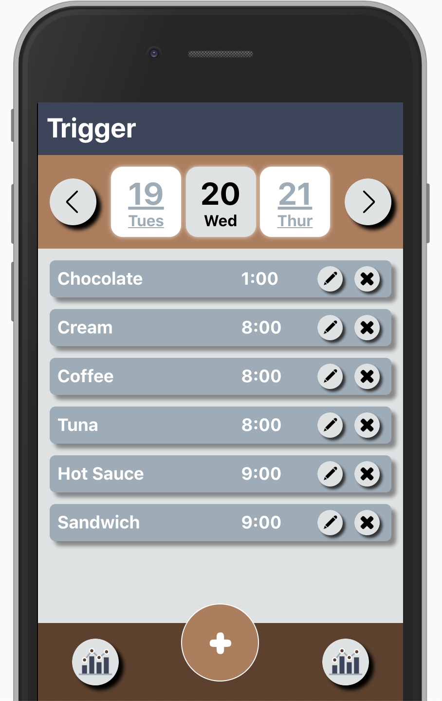
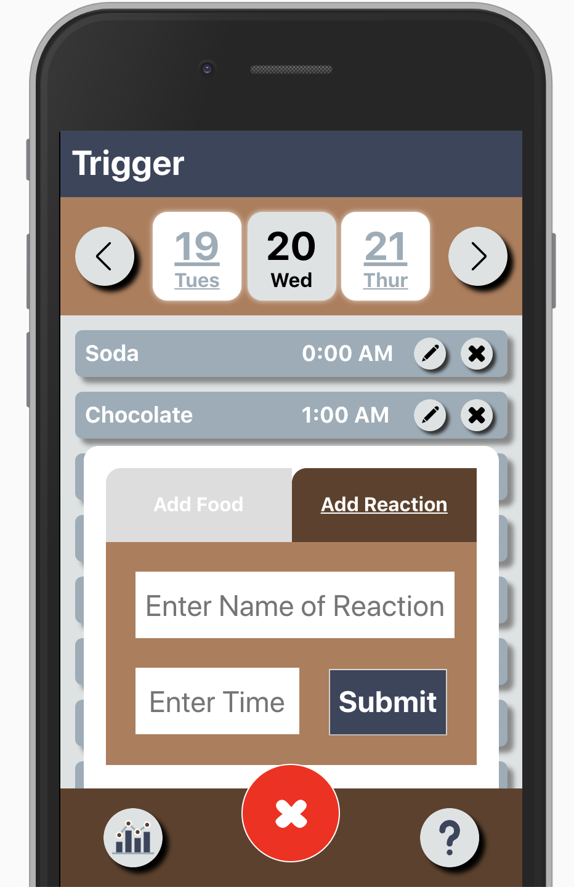
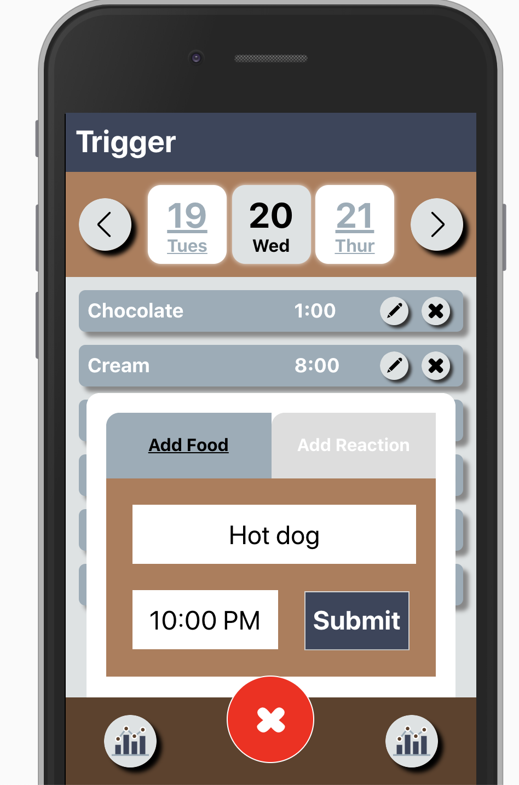
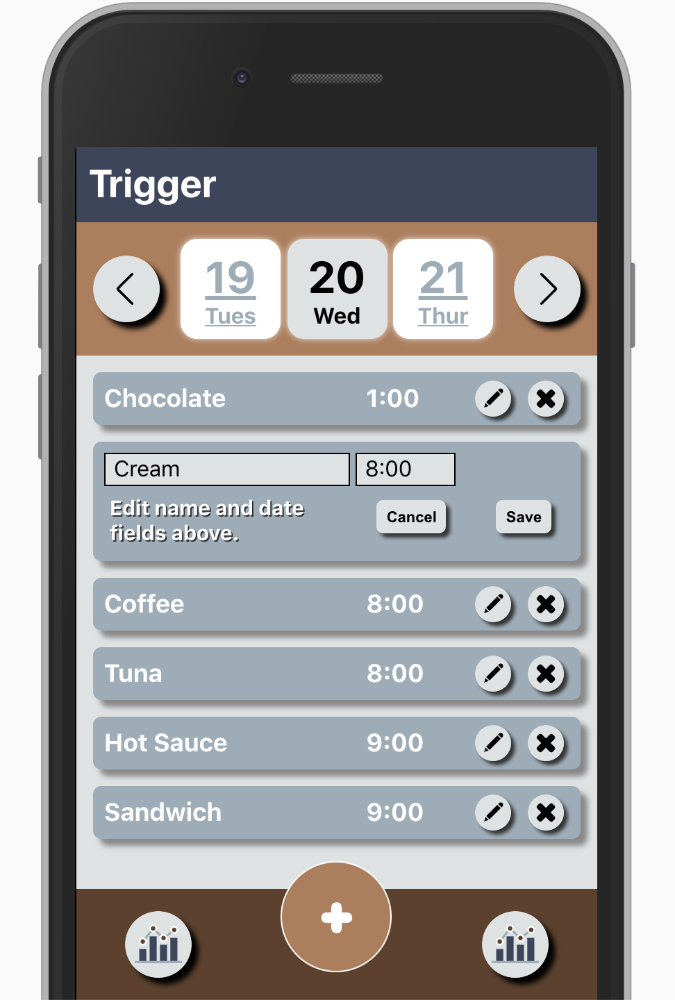
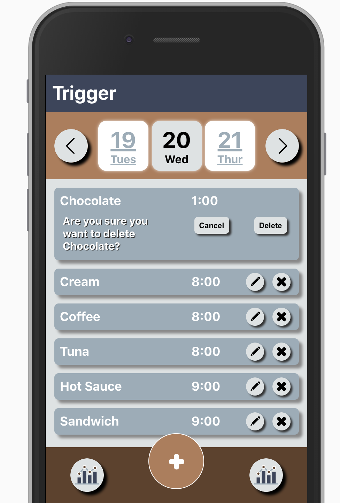
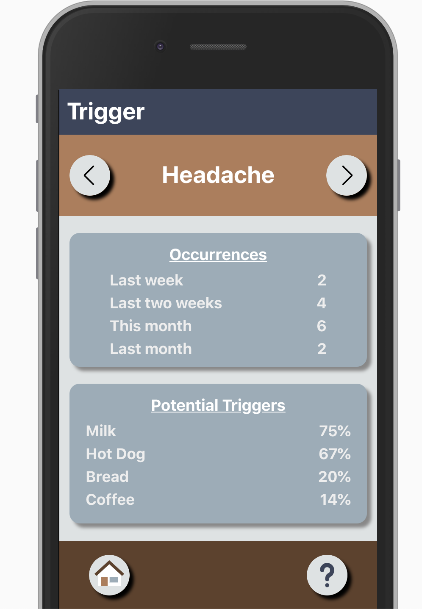

[]

# Trigger

## Introduction
The application was design to help you track the possible triggers of you common affections. Users can add foods and affections logging them by day and hour using our simple UI, just by tapping in the days or arrows on the navbar the user can go to previous days and view foods consumed and past reactions, also our analytics sections will give the user useful information about possible triggers sorted by affections.    

## Initial Setup

These instructions will get you a copy of the project up and running on your local machine for development and testing purposes.

From GitHub clone down repository using the following commands in terminal:
* `git clone git@github.com:Diazblack/trigger.git`
* `cd trigger`

## How to Use

In the project directory run:

### `npm install`

To install all the dependencies.

### Running the Server Locally

### `npm start`

Runs the app in the development mode, to view it in the browser click the link bellow:
[http://localhost:3000](http://localhost:3000).

### `npm test`

Launches the test runner, after the test suite run it will display the coverage.

### Home Page

When a user first visits the page they see an index of foods and affections for the current day, they are sorted by hour. The grey background represent the food items and the brown background for the affections. The user can scroll the date using the icons on the navbar, click on the date will populate the page with the items of the particular date, and tapping in the arrows let the user navigate through the previous or next dates.  

#### Adding new Foods or Affections
A user can tap on the red `+` button at the bottom of the page, a form will emerge where the user can choose between foods or reactions, add the hour when the food was consumed and click submit to add the item to the current date, displayed on the center of the navbar.

__Note:__ the time should be added in the format `hh:mm PM`(10:00 AM). Also if the user want to add the item to a  different date should scroll to the particular date to add it.

#### Editing Foods or Affections

Next to each food or affection the user will see the icon of a pencil what allows to update the information in the entry. When the button is tap the two forms will display allowing to change the name or the time of the item. In order to save the changes the use should click the button save. If the user decide not the proceed with the changes it can tap the cancel button leaving the item in the previous state.

#### Deleting Foods or Affections
A user can click on the icon `X` next to each item to delete the entry, when the icon is clicked two new button will appear, the user can click on cancel or on delete to proceed with the changes.

#### Analytics

In the bottom left corner of the app it can be found a the an icon for the analytics (the round icon with the columns). When the icon is tap the the page will display the analytics information.

When the analytics is display at the top the user can scroll through the Affections using the arrows on the sides. Bellow the app will display the occurrences of the affection in different periods of time. Also bellow the user will see a scrollable component with the potential triggers, the percentages on the right of the names indicate the correlation between the affection and the food. At the bottom right corner of the page there is an `?` icon and when is clicked it will display relevant information about the analytics page.  

__Note:__ The result of the app are not absolute, before of taking any decision talk to your doctor.

## Production and Services

A link of the backend app can be found with the documentation [here](https://github.com/prestonjarnagin/trigger_backend).

The link of the application on Production can be found [Right Here](https://trigger-105.herokuapp.com/).

## Core Contributors

### Front End Creators
* Cesar Jolibois - Github: [Diazblack](https://github.com/Diazblack)
* Michael Gatewood - Github: [mngatewood](https://www.github.com/mngatewood)

### Back End Creators
* Quinn krug - Github: [Q-Win](https://github.com/Q-Win)
* Preston Jarnagin - Github: [prestonjarnagin](https://www.github.com/prestonjarnagin)

## You Want To contribute

You can fork and clone, if you generate a PR we can start a discussion about of the feature you build or you can contact us in the links above.   

## Built With

* [JavaScript](https://www.javascript.com/)
* [Node.js](https://nodejs.org/)
* [React](https://reactjs.org/)
* [Redux](https://redux.js.org/)
* [Emzyme](https://github.com/airbnb/enzyme)
